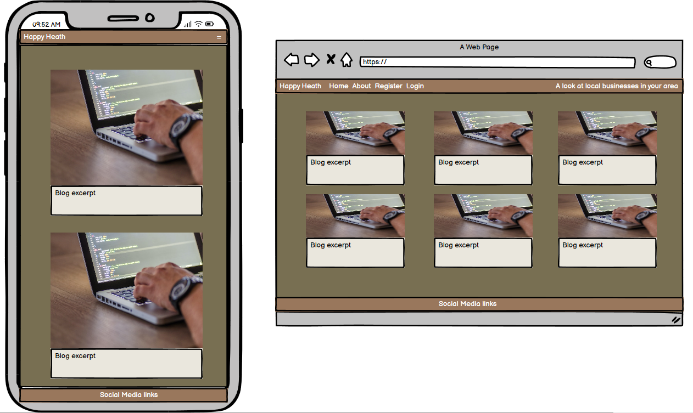

# Happy Heath

## Introduction

Happy Heath is a blog website showcasing local businesses and the Site Admins experience of them. This website has been developed as part of the Code Institute’s Full-Stack Developer Bootcamp course as my assessed project - focusing on a Django framework, Database manipulation, and CRUD functionality. This project is for educational purposes only.

View live site here : [Happy Heath](https://happy-heath-3daa657fbb51.herokuapp.com/)  
  
For Admin access with relevant sign-in information: [Happy Heath Admin](https://happy-heath-3daa657fbb51.herokuapp.com/admin/login/?next=/admin/)

## Table of Contents

- [Happy Heath](#Happy Heath)
  - [Introduction](#introduction)
  - [Table of Contents](#table-of-contents)
  - [Overview](#overview)
- [UX - User Experience](#ux---user-experience)
  - [Colour Scheme](#colour-scheme)
  - [Font](#font)
- [Project Planning](#project-planning)
  - [Strategy Plane](#strategy-plane)
    - [Site Goals](#site-goals)
  - [Agile Methodologies - Project Management](#agile-methodologies---project-management)
    - [MoSCoW Prioritization](#moscow-prioritization)
  - [User Stories](#user-stories)
    - [Visitor User Stories](#visitor-user-stories)
  - [Scope Plane](#scope-plane)
  - [Structural Plane](#structural-plane)
  - [Skeleton \& Surface Planes](#skeleton--surface-planes)
    - [Wireframes](#wireframes)
    - [Database Schema - Entity Relationship Diagram](#database-schema---entity-relationship-diagram)
    - [Security](#security)
- [Features](#features)
  - [User View - Registered/Unregistered](#user-view---registeredunregistered)
  - [CRUD Functionality](#crud-functionality)
  - [Feature Showcase](#feature-showcase)
  - [Future Features](#future-features)
- [Technologies \& Languages Used](#technologies--languages-used)
  - [Libraries \& Frameworks](#libraries--frameworks)
  - [Tools \& Programs](#tools--programs)
- [Testing](#testing)
- [Deployment](#deployment)
  - [Connecting to GitHub](#connecting-to-github)
  - [Django Project Setup](#django-project-setup)
  - [Cloudinary API](#cloudinary-api)
  - [Elephant SQL](#elephant-sql)
  - [Heroku deployment](#heroku-deployment)
  - [Clone project](#clone-project)
  - [Fork Project](#fork-project)
- [Credits](#credits)
  - [Code](#code)
  - [Media](#media)
    - [Additional reading/tutorials/books/blogs](#additional-readingtutorialsbooksblogs)
  - [Acknowledgements](#acknowledgements)

## Overview

Happy Heath is a blog site about experiences with local businesses. Users are invited to:

- Join the Happy Heath community
- Create their own profiles
- Interact with reviews through the comments section

Happy Heath is accessible via all browsers with full responsiveness on different screen sizes. Its aim is to create a space where people can read about local businesses and comment on their own experiences. Many small businesses can often only be found through social media business pages and rely on word of mouth to build up business. The aim of the site is to support these businesses and drive customers to them where possible via positive blog posts. Any posts that have a critique of a business should still provide some positivity and hopefully just be to highlight a fixable negative. Happy Heath aims to provide a starting point for people to discuss and promote local businesses. In future developments I would like to invite local businesses the opportunity to promote themselves and add the functionality for users to search for businesses by type.

# UX - User Experience

### Colour Scheme

I aimed for a colour scheme that evoked feelings of warmth and trust. The colour scheme aims to provide an earthy palette in order to create an inviting and natural aesthetic.

  

### Font

In terms of Font style I opted to stay with the standard Ariel due to its familiarity with users. It is clean and professional and does not detract from other elements of the webpage.
  
# Project Planning  
 
## Strategy Plane

The project goal was to build a simple website showcasing users experiences with local businesses with the option to have a dynamic conversation about the blog posts using the comments section. My intention is to showcase local businesses and the services they offer. A rating system would be added on the idea of the user being a ‘Happy Heath’ or ‘Grumpy Croasdale’. Where possible external links to the businesses would be added in relation to social media and business websites.

### Site Goals

- Create an environment where people could rate and discuss local businesses.
- Easy UI for quick fulfilment of feature CRUD functionalities.
- UX remain the same whether on mobile, tablet or desktop
- Scalable idea, for addition of future features that would allow for business owners to promote themselves.

## Agile Methodologies - Project Management

 Happy Heath is my first project following Agile planning methods. I used my [Github Projects Board](https://github.com/users/Heath1979/projects/4) to plan and document all of my work.

### MoSCoW Prioritization

I chose to follow the MoSCoW Prioritization method for Happy Heath, identifying and labelling my:

- **Must Haves**: the 'required', critical components of the project. Completing my 'Must Haves' helped me to reach the MVP (Minimum Viable Product) for this project early, allowing me to develop the project further than originally planned. 
- **Should Haves**: the components that are valuable to the project but not absolutely 'vital' at the MVP stage. The 'Must Haves' must receive priority over the 'Should Haves'.
- **Could Haves**: these are the features that are a 'bonus' to the project, it would be nice to have them in this phase, but only if the most important issues have been completed first and time allows.
- **Won't Haves**: the features or components that either no longer fit the project's brief or are of very low priority for this release. 

## User Stories

User stories and features recorded and managed on [GitHub Projects](https://github.com/users/Heath1979/projects/4)

### Visitor User Stories

| User Story | Priority |
|----------------------------------------------------------------------------------------------------------------------------|---------------|
| As a **user**, I would like to **view a paginated list of posts** so that I can **select which post I want to view** | **MUST HAVE** |
| As a **site user**, I would like to **click on a post** so that I can **read the full text** | **MUST HAVE** |
| As a **user**, I would like to **check my profile page** so that I can **see my history and amend my details** | **COULD HAVE** |
| As a **site user/admin**, I would like to **view comments on an individual post** so that I can **see feedback on the post** | **SHOULD HAVE** |
| As a **site user**, I would like to **regisger an account** so that I can **comment on a post** | **MUST HAVE** |    
| As a **user**, I would like to **access a blank review/blog template** so that I can **create my own post** | **WONT HAVE** | 
| As a **user**, I would like to **comment on a post** so that I can **interact with the community** | **SHOULD HAVE** | 
| As a **site user**, I would like to **be able to modify or delete a comment on a post** so that I can **make amendments** | **SHOULD HAVE** | 
| As a **user**, I would like to **be able to access external links** so that I can **learn more about the topics in the posts** | **COULD HAVE** | 
| As a **site admin**, I would like to **create, read, update, and delete posts** so that I can **can manage my blog content** | **MUST HAVE** | 
| As a **site admin**, I would like to **create draft posts** so that I can **so that I can finish writing content at a later date** | **SHOULD HAVE** | 
| As a **user**, I would like to **filter the posts by category** so that I can **so that I can view posts on a category I am interested in** | **COULD HAVE** | 
| As a **user**, I would like to **filter the posts by location** so that I can **so that I can view posts based on a particular location** | **COULD HAVE** | 
| As a **user**, I would like to **learn what the posts are about** so that I can **so that I can understand the purpose of the website** | **SHOULD HAVE** |     
| As a **site admin**, I would like to **create and update the about page content** so that I can **keep the page updated with the most relevant information** | **MUST HAVE** |  
| As a **site user**, I would like to **be able to contact the site admin** so that I can **make a request to collaborate or make recomendations** | **COULD HAVE** |  
| As a **site admin**, I would like to **be able to store contact requests** so that I can **review them at a later date** | **COULD HAVE** |  

## Scope Plane

As this would be a dual learning/building project using technologies that were new to me, such as Django, SQL, Bootstrap and Cloudinary, I was cautious to maintain consistent control over the scope of the project and not let my idea grow too big. I needed to lockdown my project features early on into manageable blocks so as not to lose track of the MVP. Following Agile Planning Methodologies, I added my User Stories as issues on my [GitHub Projects](https://github.com/users/Heath1979/projects/4) to keep the flow of the project in check.

Essential features of my project were:
- An accessible website that fulfils user needs
- Responsive website for users of mobile, tablet and desktop devices
- User Authentication
- User profile creation and editing
- Comment feature with full CRUD functionality
- About me details to inform the user

Planning my project thoroughly from the start allowed me to identify areas of importance for MVP completion and satisfaction of assessment criteria, and to balance them with the feasibility of the features.

## Structural Plane

From initial concept through to finished product I opted to use standard navigation elements to keep with the theme of familiarity. Bootstrap was used to help control the flexibility of the site across multiple screen sizes. 

## Skeleton & Surface Planes

### Wireframes

The wireframes for Happy Heath were made using Balsamiq. I was sure of the structure of the site and had a general feel of how the colour scheme would work within the structure prior to beginning the project but was prepared to adapt as the project reached its conclusion. Wireframes as below have only been created for the Blog and About pages as all login and registration forms would be created by Allauth.

**Mobile and Desktop views for:**
 
- About
- Paginated posts
- Blog post

  
About Wireframe

  

  

  
Paginated posts Wireframe

  

  
Blog posts Wireframe

  

### Database Schema - Entity Relationship Dagram

*Database Schema (ERD) for Haappy Heath diaplaying relationships between feature components saved within the database*

This Entity Relationship Diagram(ERD) demonstrates how each feature interacts with each other and the connected PostgreSQL Database. Using Django's User Model, and Django AllAuth to carry out all user authentication, a user_id is created when the user registers with their username and email. This allows the user to add and edit comments which will display their username. For future development users will be able to create their own blog posts and set comment approvals.

The User, Post and Comments Models were inspired by the blog walkthrough by the Code Institute. This helped me to get a grasp of the templating structure and connected Python files.

### Security

A number of security steps were taken in this project in order to protect the user's submitted data. Unlike a strictly informative website, Happy Heath allows the user to become part of the community and interact with the posts. To meet the strict internet standards of protecting a user's data, the following processes were included in the project's development.

**AllAuth**  

Django AllAuth is an installable framework that takes care of the user registration and authentication process. Authentication was needed to determine when a user was registered or unregistered and it controlled who could add comments to the posts. The setup of AllAuth included:

- installing it to my workspace dependencies
- adding it to my INSTALLED_APPS in my settings.py
- sourcing the AUTHENTICATION_BACKENDS from the AllAuth docs for my settings.py
- adding its URL to my projects 'urls.py'
- run database migrations to create the tables needed for AllAuth
- (For this version of Happy Heath, to meet MVP, email and social accounts were not configured as part of the feedback/sign up options to the user.)
  
**Defensive Design**  

Happy Heath was developed to ensure a smooth user experience, to the best of my current learning experience with Django. 

- Input validation and error messages provide feedback to the user to guide them towards the desired outcome. 
- Authentication processes control edit/delete icons to reveal them to the comment author only. 
- Deletion of data is confirmed through an additional modal, double-checking with the user.
- Testing and validation of features completes the process.

**CSRF Tokens** 

CSRF (Cross-Site Request Forgery) tokens are included in every form to help authenticate the request with the server when the form is submitted. Absence of these tokens can leave a site vulnerable to attackers who may steal a users data.
  
# Features

## User View - Registered/Unregistered

It was important to me from the beginning that Happy Heath be accessible to an unregistered user, in some capacity. I wanted the website to sell the idea of using local businesses to a new user quickly by immediately inviting them into the community through the blogs and comments sections. The following is a breakdown of the site's accessibility for registered/unregistered users:

| Feature | Unregistered User | Registered, Logged-In User |
|-----------|-------------------|-----------------|
| About page | Visible | Visible |
| Paginated blogs | Visible | Visible |
| Blog post | Visible | Visible |
| Comments | Visible but not able to add/amend | Visible with full feature interaction |

## CRUD Functionality

Users are able to Create, Read, Update and Delete their shared information on Happy Heath. Some features make full CRUD functionality available, whilst others present the necessary options only. Here is my CRUD breakdown for Happy Heath:

| Feature | Create | Read | Update | Delete |
|---------|--------|------|--------|--------|
| Profile | Created upon registration | No | No | Full profile deletion is currently only available to Admin upon user account deletion |
| Posts | By admin only | Yes | By admin only | By admin only |
| Comments | Yes for registered users | Yes | Yes for registered users | Yes for registered users |

## Feature showcase

*For features showcase screenshots were taken on laptop*

**Header/Navigation & Footer**

  
Header & Navigation - all users (laptop)

  

  

  
Header & Navigation - all users (mobile)

  

  

  
Footer - all users

  

  

**About Page**

  
About page - all users

  

 

**Paginated Posts**

  
Paginated posts - all users

  

 

**Blog Post**

  
Paginated posts - all users

  

**Comments**

  
Comments - all users

  

**Registration/Sign Up**

  
Registration - all users

  

**Sign In**

  
Sign in - all users

  

**Sign Out**

  
Sign out - all users

  

**Admin Panel**

  
Admin panel

  

## Future Features

- **Social account login**: Allowing popular social account login to the Happy Heath site will speed up the registration and booking process.
- **Business pages**: Allow for businesses to sign up and advertise. Create a safe space for interaction between businesses and customers.
- **Member to business contact**: Customers can send direct messages to businesses through the website.
- **Add picture gallery to posts**: Allows the community to post images that will support the good work of the business that is the topic of the post.
- **User profile**: Users can view a profile and amend as required.
- **Notifications**: Users receive some form of notification when new posts are created. Notifications can be set in a user profile.

# Technologies & Languages used

- HTML
- CSS
- JavaScript
- Python
- [Github](https://www.github.com) used for online storage of codebase and Projects tool.
- [Gitpod](https://www.gitpod.io) as an online, cloud-based IDE for development.
- Blasamiq for design planning and wireframes.
- [Cloudinary](https://cloudinary.com/) was used for cloud media storage of user uploaded images.
- [Django](https://www.djangoproject.com/) was used as the Python framework for the site.
- [Heroku](https://www.heroku.com) was used to host the FreeFido application.
- [WAVE](https://wave.webaim.org/) to evaluate the accessibility of the site.
- PostgreSQL database required to collect and recall users data supplied by the Code Institute.

## Libraries & Frameworks

- Bootstrap v.5.0.1
- Cloudinary v.1.41.0
- Crispy Bootstrap5 v.0.7
- Django v.4.2.16
- Django AllAuth v.0.57.2
- Django Crispy Forms v.2.3
- Django Summernote v.0.8.20.0

Further information is available in the [requirements.txt file](rquirements.txt)

## Tools & Programs

- [Convertio](https://convertio.co/) for file conversion to PNG, WEBP.
- [Lucid](https://lucidchart.com) for creating the ERD.
- [Perplexity AI](https://www.perplexity.ai/) for breaking down Python concepts and models and explaining the relationships.
- [LogoDesign](https://logodesign.ai/) for generating brand logo to be used as the Favicon.
- [Favicon](https://favicon.io/) to create favicon.

# Testing

- for all testing please refer to the [TESTING.md](TESTING.md) file.

## Credits

### **Content References**

All content written for this site is purely for educational purposes. Actual businesses were used as the basis for each blog post.
- [Facebook](https://www.facebook.com) for Facebook business profiles.
- [YouTube](https://www.youtube.com) for supporting videos on the advertised businesses. Credit to Visit Fylde Coast, 

### **Media References**
- [Pexels](https://www.pexels.com/) for images used on this site. credit to Rodrii Sabino.
- [Notionavenue](https://www.notionavenue.co/) for hex color code for comments delete button.
- [Coolers](https://coolors.co/) for color generator used for pallette for the site.
- [AWeber](https://blog.aweber.com/) for advice on fonts used for a blog site.

### **Code**

The following sites complemented my learning for this project alongside the [Code Institute's](https://codeinstitute.net/ie/) learning content.

- [Geeksforgeeks](https://www.geeksforgeeks.org/) for setting a plaveholder in a URLField
- [W3Schools](https://www.w3schools.com/) for advice on resizing objects in relation to the images on this site