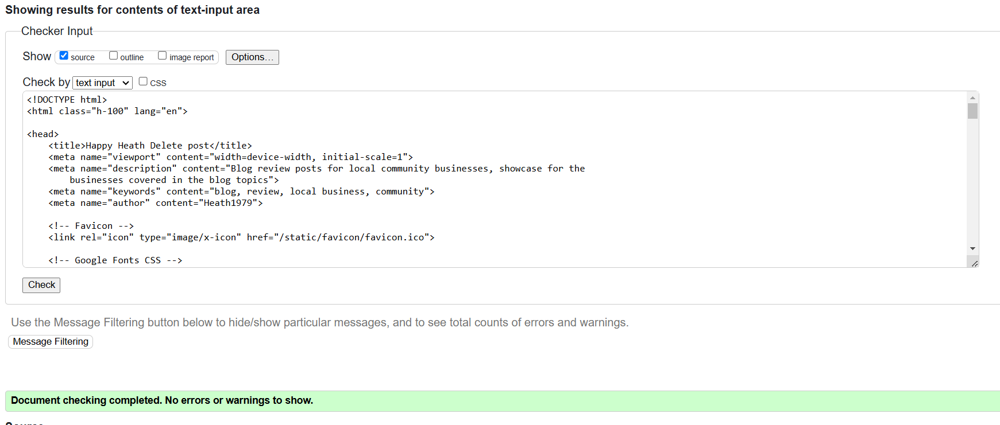
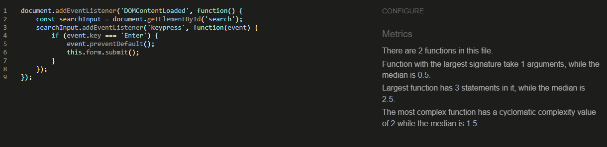
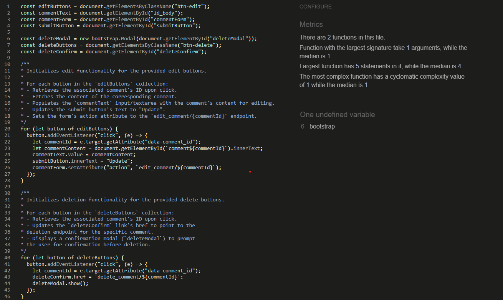
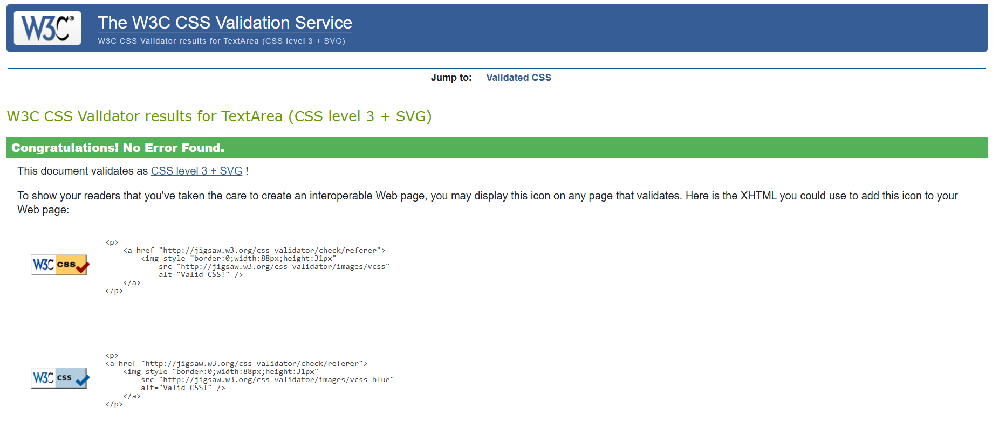
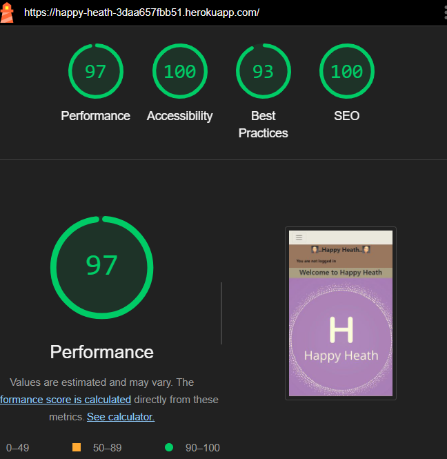
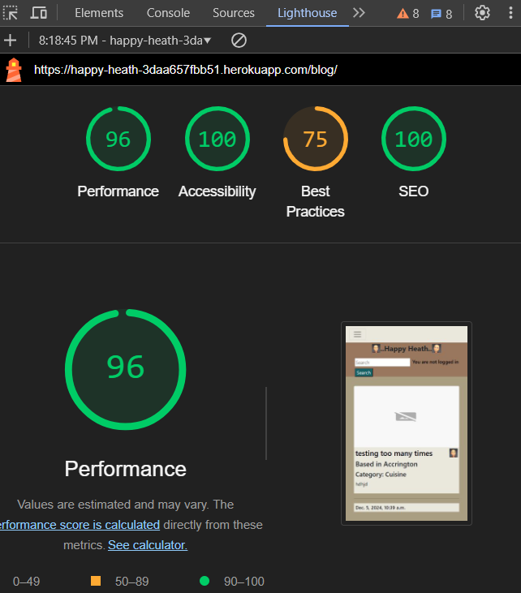
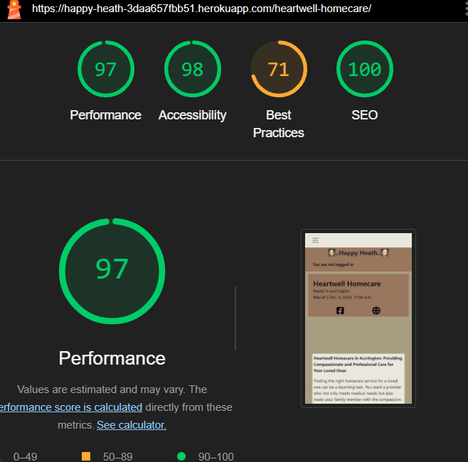
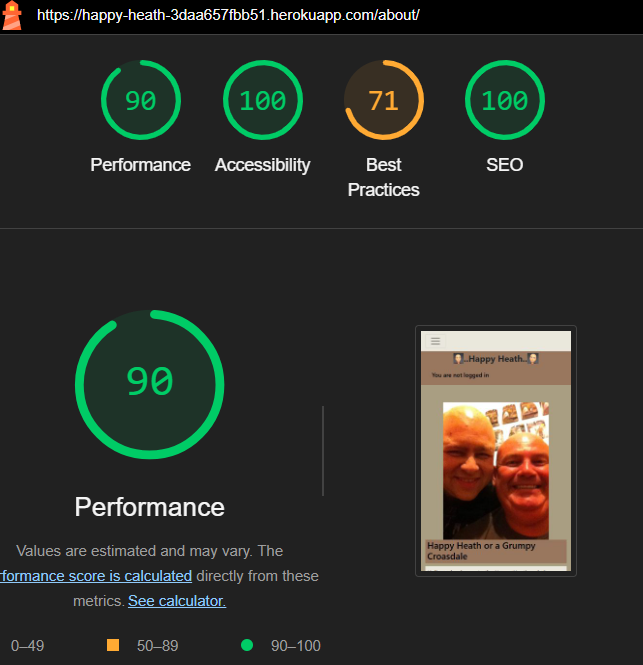

# Testing

This is the TESTING file for the [Happy Heath](https://happy-heath-3daa657fbb51.herokuapp.com/) website.

Return back to the [README.md](README.md) file.

## Testing Contents  
  
- [Testing](#testing)
  - [Testing Contents](#testing-contents)
  - [Validation](#validation)
    - [HTML Validation](#html-validation)
    - [JavaScript Validation](#javascript-validation)
    - [Python Validation](#python-validation)
    - [CSS Validation](#css-validation)
    - [Lighthouse Scores](#lighthouse-scores)
    - [Wave Accessibility Evaluation](#wave-accessibility-evaluation)
  - [Manual Testing](#manual-testing)
    - [User Input/Form Validation](#user-inputform-validation)
    - [Browser Compatibility](#browser-compatibility)
    - [Testing User Stories](#testing-user-stories)
    - [Dev Tools/Real World Device Testing](#dev-toolsreal-world-device-testing)
  - [Bugs](#bugs)
    - [Known Bugs](#known-bugs)

## Validation

### HTML Validation

For my HTML files I have used [HTML W3C Validator](https://validator.w3.org) to validate all of my HTML files.

Due to using Jinja syntax such as ' I had to use a different approach to checking my HTML as the validator would show errors if copying the HTML direct from the files in the Happy Heath project. My method to check my HTML was as follows:

- Using the deployed version from Heroku I navigated to each page.
- Right clicking on the page brought up a options menu with the option to view the page source located at the bottom.
- The complete HTML code for that page will then appear in a separate window.
- Copy that code and paste into the [validate by input](https://validator.w3.org/#validate_by_input) option.
- Check for errors and warnings, fix any issues, and then repeat the steps to revalidate.

 

All HTML pages were validated and the pages generated solely by myself received a 'No errors or warning to show' result as shown above.

Initially my searh function raised a [warning](documentation/testing/search_validation_error.png) for the role attribute in the search function. The sign up page raised 4 [warnings](documentation/testing/validation_register.png) which is due to Django allauth forms. [Errors](documentation/testing/validator_add_post.png) were raised on the add post page which were generated by Summernote. These [Errors](documentation/testing/validator_edit_post.png) were repeated with the edit post page.

| HTML source Code/Page | Errors | Warnings |
| ---- | ----- | ------|
| Home | 0 | 0 |
| Blogs | 0 | 0 |
| Blog Post | 0 | 0 |
| About | 0 | 0 |
| Add post | 8 | 0 |
| Await approval | 0 | 0 |
| Edit post | 8 | 0 |
| Delete post | 0 | 0 |
| Register | 4 | 0 |
| Log in | 0 | 0 |
| Log out | 0 | 0 |

### JavaScript Validation

[JSHint](https://jshint.com/) was used to validate the small amount of JavaScript code added to the project. External JS, for Bootstrap purposes, obtained via [CDN](https://cdn.jsdelivr.net/npm/bootstrap@5.0.1/dist/css/bootstrap.min.css) was not validated through JSHint.

| Page | Screenshot | Errors | Warnings |
| ---- | ------ | ------ | ------ | 
| base.html |  | none | none |
| post_detail.html |  | none | none |

### Python Validation

[CI Python Linter](https://pep8ci.herokuapp.com) was used to validate the Python files that were created or edited by myself. No issues presented. I have included some screenshots with the results below.

| Feature | admin.py | forms.py | models.py | urls.py | views.py |
| ---- | ---- | ------- | ------ | ----- | -----|
| Config | n/a | n/a | n/a | [No Errors](documentation/testing/config_urls.png) | n/a |
| Blog | [No Errors](documentation/testing/blog_admin.png) | [No Errors](documentation/testing/blog_forms.png) | [No Errors](documentation/testing/blog_models.png) | [No Errors](documentation/testing/blog_urls.png) | [No Errors](documentation/testing/blog_views.png) |
| About | [No Errors](documentation/testing/about_admin.png) | [No Errors](documentation/testing/about_forms.png) | [No Errors](documentation/testing/about_models.png) | [No Errors](documentation/testing/about_urls.png) | [No Errors](documentation/testing/about_views.png) |

### CSS Validation

[W3C CSS Validator](https://jigsaw.w3.org/css-validator/) was used to validate my CSS file. External CSS for Bootstrap, provided by [CDN](https://cdn.jsdelivr.net/npm/bootstrap@5.0.1/dist/css/bootstrap.min.css) was not tested. 

  

 

### Lighthouse Scores

Lighthouse testing was carried out in Incognito mode to acheive the best result. Performance was lower than preferred due to the site being image heavy. Static images used in the sites design were saved in webp. Image types added by a site user are at there own discretion and could affect the score. The CDNs used for Bootstrap were also noted in the Lighthouse report as causing issue with performance. This report will be reviewed for future development of Happy Heath to raise this score.

*Desktop Home Page*  
  

*Desktop Paginated Blogs Page*

*Desktop Blog Post Page*  
  

*Desktop About Page*
  

## Manual Testing

### User Input/Form Validation

Testing was carried out on desktop using a Chrome browser to ensure all forms take the intended input and process the input appropriately.

| Feature | Tseted? | User Input required | User Feedback Provided | Pass/Fail | Fix |
| ------- | ------- | ------------------- | ---------------------- | --------- | --- |
| Navbar | Yes | Click | The user is directed to the specific page as intended | Pass | - |
| Register Page | Yes | Username/Password. Email is optional | Empty username and password fields prompt the user. [username/password](documentation/testing/password_similar.png) too similar, password too short | Pass | - |
| Login | Yes | Username and Password | Username and Password must be exactly as originally registered. User notified once successfully signed in. | Pass | - |
| Search field | Any input accepted but Search results are tailored to Location, Category, and Post title. | Users will be presented with the results of their search. If no

## Bugs

| No. | Bug | Solved | Fix | Commit no. |
| --- | ---- | ----- | --- | ---------- |
| 1 | Comments not showing when full post opened up | Yes | Added approved line to Comments modal | 57188d7 |
| 2 | Blog for Harle.tech post had a white backing not aligned to rest of blog posts | Yes | Content had been copied in from a doc and imported backing with it. Re-wrote to clear | 3f31836 |
| 3 | Image and content disappeared on Harle.tech post after weblinks implemented | Yes | changed default tag for no available url to a 
 from <a> | 39a32d7 |
| 4 | Favicon not loading | Yes | Missed % at the end of the DTL tag | 54faba0 |
| 5 | Search functionality for posts caused site to crash | Yes | Function in views did not take into account that category and location are foreign keys | 63459b9 |
| 6 | add_post.html not loading for a logged in user on the post link | Yes | blogs/urls.py pathways needed to be re-ordered. Path to the page was initially added at the bottom of the list when should have been second in the list | ddf898e |
| 7 | Images not sizing correctly on post_detail.html | Yes | Added white background and used object fit in css. Would alos recomend resizing image before adding to post | 605ffb1 |
| 8 | User could not add a new location when creating a post | Yes | Issue with initial modal set ups for location and category. Both amended and AddPost form amended to allow for the changes | 2d3cb31 |
| 9 | Search function returning user to the home page | Yes | When a new home page was added the return URL in the HTML function was not updated to accommodate the new page. Testing raised the error and code amended | dc6eea6 |

